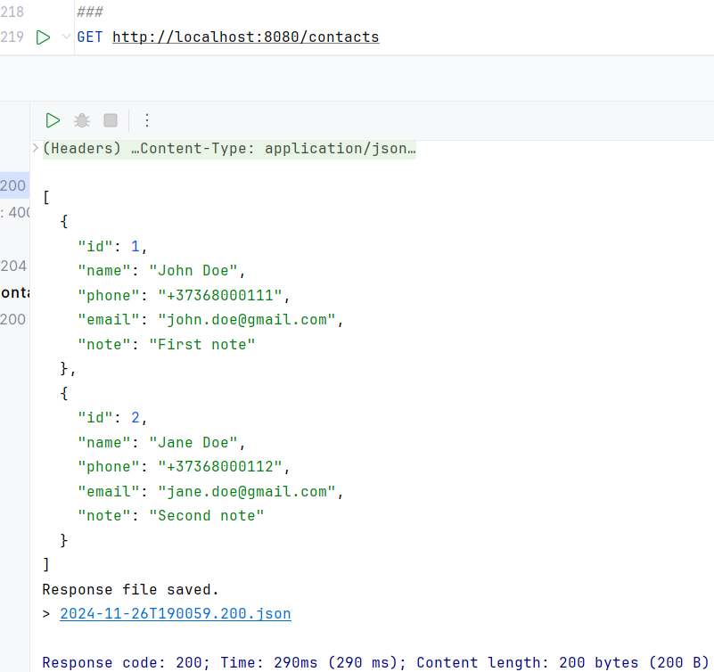

## Цель задания
Каждый студент может выбрать один из вариантов в зависимости от своих предпочтений и специализации:

Backend: разработать серверное приложение для управления данными или реализовать REST API.

## Задание для backend

Тема: "Менеджер контактов"
Разработайте CRUD-приложение для управления контактами. Контакт включает следующие поля:

- name (имя, обязательное, строка)
- phone (номер телефона, обязательное, строка)
- email (электронная почта, необязательное, строка)
- note (заметка, необязательное, текст)

# Contact Manager Application

## Описание проекта
Contact Manager — это CRUD-приложение для управления контактами. Приложение позволяет добавлять, обновлять, удалять и просматривать информацию о контактах, включая имя, номер телефона, email и заметки.

## Используемые технологии
- **Java 17**
- **Spring Boot 3**: для создания RESTful API.
- **Spring Data JPA**: для работы с базой данных.
- **Lombok**: для уменьшения шаблонного кода.
- **Hibernate Validator**: для проверки валидности данных.
- **H2 Database**: в качестве встроенной базы данных (можно заменить на любую другую).
- **Jakarta Validation**: для аннотаций валидации полей.
- **Maven**: для управления зависимостями.

## Структура кода
```plaintext
src/main/java/com/example/ContactManager/
├── controller/
│   └── ContactController.java       # Контроллер для обработки запросов API
├── entity/
│   └── Contact.java  # Модель Contact с аннотациями JPA и валидации
├── exception/
│   └── GlobalExceptionHandler.java  # Обработчик исключений
├── repository/
│   └── ContactRepository.java       # Репозиторий для взаимодействия с базой данных
├── service/
│   └── ContactService.java          # Сервисный слой для бизнес-логики
```

## Доступные эндпоинты

### Получить список всех контактов
**URL:** `/contacts`  
**Метод:** `GET`  
**Описание:** Возвращает список всех контактов.

**Демонстрация работы:**


